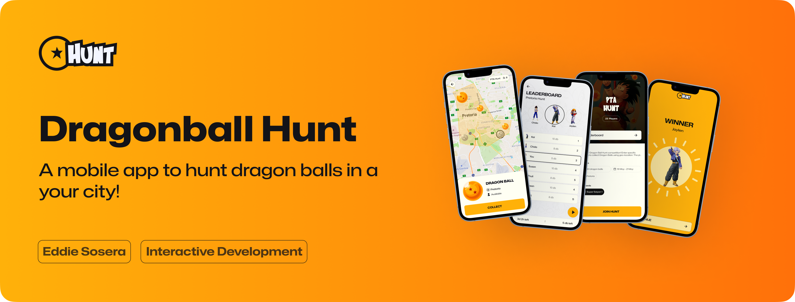

<!-- Repository Information & Links-->

[![LinkedIn][linkedin-shield]][linkedin-url]
[![Instagram][instagram-shield]][instagram-url]

 

Eddie Sosera · 21100419

     

<!-- Cover Image-->
 

<!-- HEADER SECTION -->
 

  
  
  <h3 align="center">DBHunt</h3>
  

    Let the Hunt begin!
     
     
      <a href="https://github.com/eddiesoseradbhunt"><strong>Explore the docs »</strong></a>
    
    
   <a href="path/to/demonstration/video">View Demo</a>
    ·
    <a href="https://github.com/username/dbhunt/issues">Report Bug</a>
    ·
    <a href="https://github.com/username/dbhunt/issues">Request Feature</a>

<!-- TABLE OF CONTENTS -->

## Table of Contents

- [About the Project](#about-the-project)
  - [Project Description](#project-description)
  - [Built With](#built-with)
- [Getting Started](#getting-started)
  - [Prerequisites](#prerequisites)
  - [How to install](#how-to-install)
- [Features and Functionality](#features-and-functionality)
- [Concept Process](#concept-process)
  - [Ideation](#ideation)
  - [Wireframes](#wireframes)
  - [User-flow](#user-flow)
- [Development Process](#development-process)
  - [Implementation Process](#implementation-process)
    - [Highlights](#highlights)
    - [Challenges](#challenges)
  - [Reviews and Testing](#peer-reviews)
    - [Feedback from Reviews](#feedback-from-reviews)
    - [Unit Tests](#unit-tests)
  - [Future Implementation](#peer-reviews)
- [Final Outcome](#final-outcome)
  - [Mockups](#mockups)
  - [Video Demonstration](#video-demonstration)
- [Conclusion](#conclusion)
- [Roadmap](#roadmap)
- [Contributing](#contributing)
- [License](#license)
- [Contact](#contact)
- [Acknowledgements](#acknowledgements)

<!--PROJECT DESCRIPTION-->

## About the Project

<!-- header image of project -->

<!--  -->

### Project Description

A mobile game tournament where contestants compete to collect the most dragonballs

### Built With

<!-- angular -->

- [React Native ](https://reactnative.dev/)
<!-- Angular Material -->
- [Expo](https://expo.dev/)
<!-- other -->
- [Visual Studio Code](https://code.visualstudio.com/)

<!-- GETTING STARTED -->
<!-- Make sure to add appropriate information about what prerequesite technologies the user would need and also the steps to install your project on their own mashines -->

## Getting Started

The following instructions will get you a copy of the project up and running on your local machine for development and testing purposes.

### Prerequisites

Ensure that you have the latest version of [Expo](https://docs.expo.dev/get-started/introduction/) and [React Native](https://reactnative.dev/docs/integration-with-existing-apps) installed on your machine.

**The `Backend` for the app**
The project utilized [Firebase's](https://firebase.google.com/) services for backend functionality:

- `Firestore Database` was utilized for storing data.
- `Firebase Authentication` was used to handle authentication related service, like logging in and registering users.

### Installation

1. Download the APK (Android) or IPA (iOS).
2. Install package.

### How to Play

1. Create an account to access competitions and profile or Log in.

<!-- FEATURES AND FUNCTIONALITY-->
<!-- You can add the links to all of your imagery at the bottom of the file as references -->

## Features and Functionality

### Feature 1: Collect dragon balls

User look for dragon balls in different places on the map. If a dragon ball is collected it can no longer be collected again.

[feature1]

### Feature 2: Finds dargonballs nearby

If you a user is offline and you are in their teritorry you can loot their dragon balls, by playing a card game where you have to choose the correct card.

<!--  -->

### Feature 3: DragonBall Z avatars

Users sign up and can choose existing avatars based on DBZ characters.

<!--  -->

## Concept Process

The `Conceptual Process` is the set of actions, activities and research that was done when starting this project.

### Ideation

#### MoodBoard Segment

<!--  -->

 

### Wireframes

Home Page Wireframe

<!--  -->

 

The Inventory Page Wireframe

<!--  -->

 

The warehouse page wireframe

<!--  -->

 

### User-flow

The userflow diagram

<!--  -->

### Page Designs

Onboarding Page: Login

<!--  -->

Onboarding Page: Register

<!--  -->

Onboarding Page: Choose Avatar

<!--  -->

Home Page

<!--  -->

Inventory Page

<!--  -->

Skateboard Page

<!--  -->

Craft Page

<!--  -->

Account Page

<!--  -->

### Database Architecture

<!--  -->

<!-- DEVELOPMENT PROCESS -->

## Development Process

The `Development Process` is the technical implementations and functionality done in the frontend and backend of the application.

### Backend Functionality

 

### Implementation Process

<!-- stipulate all of the functionality you included in the project -->

- Made use of both `functionality` to implement a specific feature.
- `MVC/MVVM` design architecture implemented.
- `Plugin` for this.
- ETC.

#### Highlights

- Synchronous communication

#### Challenges

- Intergrating Mapbox into the Expo workflow with EAS

<!-- stipulate how you've conducted testing in the form of peer reviews, feedback and also functionality testing, like unit tests (if applicable) -->

#### Feedback from Reviews

`Peer Reviews` were conducted by my fellow students and lecturer. The following feedback I found useful:

- Feedback one.
- Feedback two.

#### Unit Tests

`Unit Tests` were conducted to establish working functionality. Here are all the tests that were ran:

> [!Note]
> Post man and insomnia where both used to test all backend CRUD functionality.

**Test 1** of Create User functionality :

- We tested the back of the user create function using Postman to test the CRUD

### Future Implementation

<!-- stipulate functionality and improvements that can be implemented in the future. -->

- Refining (a process).

 

## Final Outcome

<!-- MOCKUPS -->

### Mockups

#### Mockup 1

<!--  -->

 

#### Mockup 2

<!--  -->

 

<!-- VIDEO DEMONSTRATION -->

### Video Demonstration

To see a run through of the application, click below:

[View Demonstration](path/to/video/demonstration)

<!-- ROADMAP -->

## Roadmap

See the [open issues](https://github.com/username/projectname/issues) for a list of proposed features (and known issues).

<!-- CONTRIBUTING -->

## Contributing

Contributions are what makes the open-source community such an amazing place to learn, inspire, and create. Any contributions you make are **greatly appreciated**.

1. Fork the Project
2. Create your Feature Branch (`git checkout -b feature/AmazingFeature`)
3. Commit your Changes (`git commit -m 'Add some AmazingFeature'`)
4. Push to the Branch (`git push origin feature/AmazingFeature`)
5. Open a Pull Request

<!-- AUTHORS -->

## Author(s)

- [eddiesosera](https://github.com/eddiesosera)

<!-- LICENSE -->

## License

Distributed under the MIT License. See `LICENSE` for more information.\

<!-- LICENSE -->

## Contact

- **Eddie Sosera** - [email@address](mailto:email@address) - [LinkedIn](https//:www.linkedin.com/in/eddiesosera) - [Website](mailto:email@address) - [@instagram_handle](https://www.instagram.com/instagram_handle/)

- **Project Link** - https://github.com/eddiesosera/dbhunt
- **Backend Link** - https://github.com/eddiesosera/dbhunt-backend

<!-- ACKNOWLEDGEMENTS -->

## Acknowledgements

<!-- all resources that you used and Acknowledgements here -->

- [React Native](https://angular.io/tutorial/first-app)
- [Expo](path/to/resource)
- [Mapbox](https://www.pexels.com/photo/a-person-using-a-laptop-6372918/)

<!-- MARKDOWN LINKS & IMAGES -->

<!--
[image1]: /path/to/image.png
[image2]: /path/to/image.png
-->

<!-- Refer to https://shields.io/ for more information and options about the shield links at the top of the ReadMe file -->

[linkedin-shield]: https://img.shields.io/badge/-LinkedIn-black.svg?style=flat-square&logo=linkedin&colorB=555
[linkedin-url]: https://www.linkedin.com/in/eddiesosera/
[instagram-shield]: https://img.shields.io/badge/-Instagram-black.svg?style=flat-square&logo=instagram&colorB=555
[instagram-url]: https://www.instagram.com/edd13sc/

<!-- IMAGE LINKS: FEATURES -->

[feature1]: ./assets/img/features/1feature1.jpg
