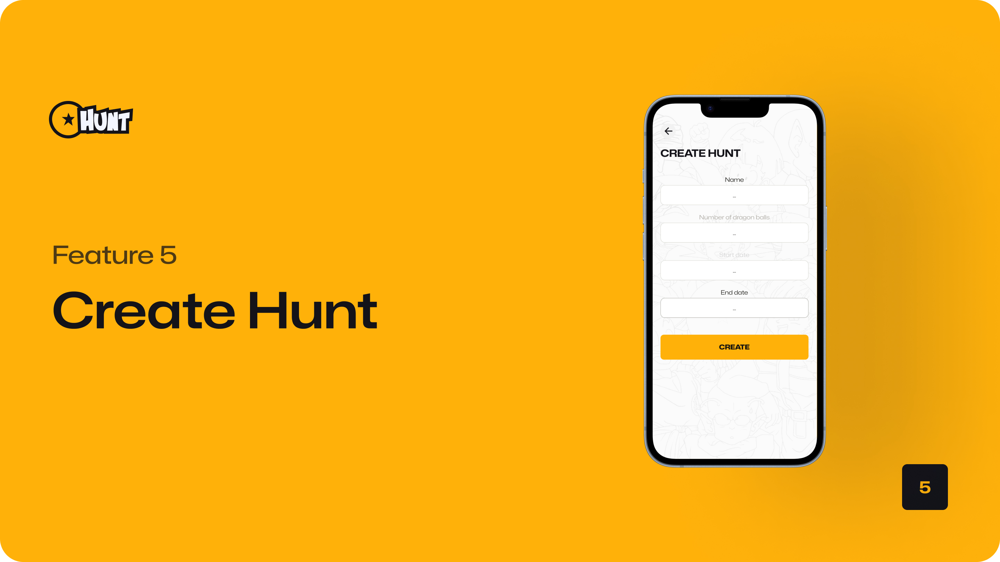

<!-- Repository Information & Links-->

[![LinkedIn][linkedin-shield]][linkedin-url]
[![Instagram][instagram-shield]][instagram-url]

<br />

<p align="center">
Eddie Sosera · 21100419
</p>
    <br />

<!-- Cover Image-->
 <a href="https://github.com/eddiesosera/dbhunt">
    
  </a>

<!-- HEADER SECTION -->
<br />

<p align="center">

  <a href="https://github.com/eddiesosera/dbhunt-v1">
    
  </a>
  
  <h3 align="center">DBHunt</h3>
  <p align="center">
    Let the Hunt begin!
    <br>
    <br>
<!--       <a href="https://github.com/eddiesoseradbhunt"><strong>Explore the docs »</strong></a>
   <br />
   <br /> -->
   <a href="path/to/demonstration/video">View Demo</a>
    ·
    <a href="https://github.com/eddiesosera/dbhunt-v1/issues">Report Bug</a>
    ·
    <a href="https://github.com/eddiesosera/dbhunt-v1/issues">Request Feature</a>
</p>
<!-- TABLE OF CONTENTS -->

## Table of Contents

- [About the Project](#about-the-project)
  - [Project Description](#project-description)
  - [Built With](#built-with)
- [Getting Started](#getting-started)
  - [Prerequisites](#prerequisites)
  - [How to install](#how-to-install)
- [Features and Functionality](#features-and-functionality)
- [Concept Process](#concept-process)
  - [Ideation](#ideation)
    <!-- - [Wireframes](#wireframes) -->
    <!-- - [User-flow](#user-flow) -->
- [Development Process](#development-process)
  - [Implementation Process](#implementation-process)
    - [Highlights](#highlights)
    - [Challenges](#challenges)
  - [Reviews and Testing](#peer-reviews)
    - [Feedback from Reviews](#feedback-from-reviews)
    - [Unit Tests](#unit-tests)
  - [Future Implementation](#peer-reviews)
- [Final Outcome](#final-outcome)
  - [Mockups](#mockups)
  - [Video Demonstration](#video-demonstration)
- [Conclusion](#conclusion)
- [Roadmap](#roadmap)
- [Contributing](#contributing)
- [License](#license)
- [Contact](#contact)
- [Acknowledgements](#acknowledgements)

<!--PROJECT DESCRIPTION-->

## About the Project


### Project Description

Dragonball Hunt is a mobile game which allows players to create and join hunts (tournaments) in your region. Players go on hunts to collect dragon balls nearby and the player with the most dragon balls at the end of the game wins and is awarded a Super Saiyan level increase.

### Built With

- [![React Native][react-badge]][react-url]
- [![Expo][expo-badge]][expo-url]
- [![Firebase][firebase-badge]][firebase-url]
- [![Google Maps][googlemaps-badge]][googlemaps-url]

<!-- GETTING STARTED -->
<!-- Make sure to add appropriate information about what prerequisite technologies the user would need and also the steps to install your project on their own machines -->

<br />
   <br />

## Getting Started

The following instructions will get you a copy of the project up and running on your local machine for development and testing purposes.

### Prerequisites

Ensure that you have the latest version of [Expo](https://docs.expo.dev/get-started/introduction/) and [React Native](https://reactnative.dev/docs/integration-with-existing-apps) installed on your machine.

**The `Backend` for the app**
The project utilized [Firebase's](https://firebase.google.com/) services for backend functionality:

- `Firestore Database` was utilized for storing data.
- `Firebase Authentication` was used to handle authentication-related services, like logging in and registering users.

### Installation

1.  Download the `Expo Go App` from `Google's Play Store` or `Apple's App Store`.
2.  Open any IDE.

3.  Clone Repository </br>
    Run the following in the command line to clone the project:

    ```sh
    git clone https://github.com/eddiesosera/dbhunt-v1
    ```

        Open `Software` and select `File | Open...` from the menu. Select the cloned directory and press `Open` button.

4.  Install Dependencies </br>
    Run the following in the command line to install all the required dependencies:

    ```sh
    npm install
    ```
<br />
   <br />
   
## How to Run the App

1. After installing Expo on your mobile phone, open the Expo app.
2. Ensure your computer and mobile device are on the same Wi-Fi network.
3. Scan the QR code displayed in your terminal or browser within your Expo app.
4. Your Expo app will load on your mobile device and changes you make to the code will auto-refresh on the device.
5. Alternatively, after running your project you can open and access it using an emulator. Read more [here](https://docs.expo.dev/workflow/android-studio-emulator/).

<br />

### Rules of the game:

1. **Join or Create a Hunt**:
   ```After creating your account, join an existing hunt in your area or create your own.```
2. **Find and Collect Dragon Balls**:
   ```Search for and collect Dragon Balls during the hunt.```
3. **View Hunt Information**:
   ```Access details about the hunt, including duration and rules.```
4. **Check Leaderboard Rankings**:
   ```Monitor your ranking compared to other players on the leaderboard. ```
5. **Win the Tournament**:
    ```At the end of the tournament period, the player with the most Dragon Balls wins.```
6. **Earn a Super Saiyan Level Boost**:
   ```The winner is awarded a Super Saiyan-level boost.```

<br />
   <br />

<!-- FEATURES AND FUNCTIONALITY-->
<!-- You can add the links to all of your imagery at the bottom of the file as references -->
## Features and Functionality


Enables users to `create a new account` or log into their `existing account`.
<br/>
<br/>


Users `look for dragon balls` in different places on the map relative to their live location. If a dragon ball is collected it can no longer be collected again.
<br/>
<br/>


Users can `join nearby hunts` to compete.
<br/>
<br/>


The leaderboard details all the contestants and their ranking in the hunt based on the dragonballs they collected.
<br/>
<br/>



Enables users to create their own hunts.
<br/>
   <br />

## Concept Process

The `Conceptual Process` is the set of actions, activities and research that was done when starting this project.

### Ideation

#### Moodboard


<br>

<!-- ### Wireframes

Home Page Wireframe

 -->

<!-- ### User-flow

The user flow diagram

 -->

### Database Architecture


<br />
   <br />

<!-- DEVELOPMENT PROCESS -->

## Development Process

The `Development Process` is the technical implementations and functionality done in the frontend and backend of the application.

### Implementation Process

<!-- stipulate all of the functionality you included in the project -->

#### Highlights

- Using the Google Maps SDK led to many `"aha" moments` as I fully explored its capabilities.
- I was proud to `reverse-engineer` addresses, converting between region names and coordinates.
- Implementing `user registration` with Firebase Authentication and Firestore Database was another highlight.
- Throughout the process, I learned when to appropriately use `asynchronous functions`.
- Finally, I enjoyed `styling React Native` elements with the same flexibility as CSS.

#### Challenges

- At the beginning of the project, I struggled to conceptualize how to use the Google Maps SDK to `obtain the user's address` and map the dragon balls relative to the user's locations.
- Calculating the `game mechanics` for determining the winner and continuing the game was challenging.

<!-- stipulate how you've conducted testing in the form of peer reviews, feedback and also functionality testing, like unit tests (if applicable) -->

<br />

#### Unit Tests

**Test 1** on iOS device:

- There were no UI issues on an iOS device.

**Test 2** on Android device:

- There were no UI issues on an Android device.

<br />

### Future Implementation

<!-- stipulate functionality and improvements that can be implemented in the future. -->

- Refining the gaming mechanism and lifecycle of the game.

<br />
   <br />

## Final Outcome

<!-- MOCKUPS -->

### Mockups


<br>
<br>

<!-- VIDEO DEMONSTRATION -->

### Video Demonstration

To see a run-through of the application, click below:

[View Demonstration](https://drive.google.com/file/d/1o6S4B8dsGbbaqzqG9LFMmoX_ZjwM2ls9/view?usp=drive_link)

<br />
   <br />

<!-- ROADMAP -->

## Roadmap

See the [open issues](https://github.com/eddiesosera/dbhunt-v1/issues) for a list of proposed features (and known issues).

<br />
   <br />

<!-- CONTRIBUTING -->

## Contributing

Contributions are what makes the open-source community such an amazing place to learn, inspire, and create. Any contributions you make are **greatly appreciated**.

1. Fork the Project
2. Create your Feature Branch (`git checkout -b feature/AmazingFeature`)
3. Commit your Changes (`git commit -m 'Add some AmazingFeature'`)
4. Push to the Branch (`git push origin feature/AmazingFeature`)
5. Open a Pull Request

<br />
   <br />

<!-- AUTHORS -->

## Authors

<div style="display: flex; justify-content: space-between;">
  <div style="text-align: center;">
    <a href="https://github.com/eddiesosera/">
      
    </a>
    <br>
    <sub>Eddie Sosera</sub>
  </div>
  </div>

  <br />
   <br />

<!-- LICENSE -->

## License

Distributed under the MIT License. See `LICENSE` for more information.

<br />
   <br />

<!-- CONTACT -->

## Contact

- **Eddie Sosera** - [email@address](mailto:email@address) - [LinkedIn](https//:www.linkedin.com/in/eddiesosera) - [Website](mailto:email@address) - [@instagram_handle](https://www.instagram.com/instagram_handle/)

- **Project Link** - https://github.com/eddiesosera/dbhunt
- **Backend Link** - https://github.com/eddiesosera/dbhunt-backend

<br />
   <br />

<!-- ACKNOWLEDGEMENTS -->

## Acknowledgements

<!-- all resources that you used and Acknowledgements here -->

- [PNGegg](https://www.pngegg.com/): for Dragonball Z images and illustrations.

<!-- Refer to https://shields.io/ for more information and options about the shield links at the top of the ReadMe file -->

[linkedin-shield]: https://img.shields.io/badge/-LinkedIn-black.svg?style=flat-square&logo=linkedin&colorB=555
[linkedin-url]: https://www.linkedin.com/in/eddiesosera/
[instagram-shield]: https://img.shields.io/badge/-Instagram-black.svg?style=flat-square&logo=instagram&colorB=555
[instagram-url]: https://www.instagram.com/edd13sc/

<!-- RESOURCES USED LINK -->

[react-badge]: https://img.shields.io/badge/React-20232A?style=for-the-badge&logo=react&logoColor=61DAFB
[react-url]: https://reactnative.dev
[expo-badge]: https://img.shields.io/badge/Expo-000020?style=for-the-badge&logo=expo&logoColor=white
[expo-url]: https://docs.expo.dev/
[firebase-badge]: https://img.shields.io/badge/Firebase-FFCA28?style=for-the-badge&logo=firebase&logoColor=white
[firebase-url]: https://firebase.google.com/
[googlemaps-badge]: https://img.shields.io/badge/Google%20Maps-4285F4?style=for-the-badge&logo=googlemaps&logoColor=white
[googlemaps-url]: https://developers.google.com/maps
[vscode-badge]: https://img.shields.io/badge/VS%20Code-007ACC?style=for-the-badge&logo=visual-studio-code&logoColor=white
[vscode-url]: https://code.visualstudio.com/
